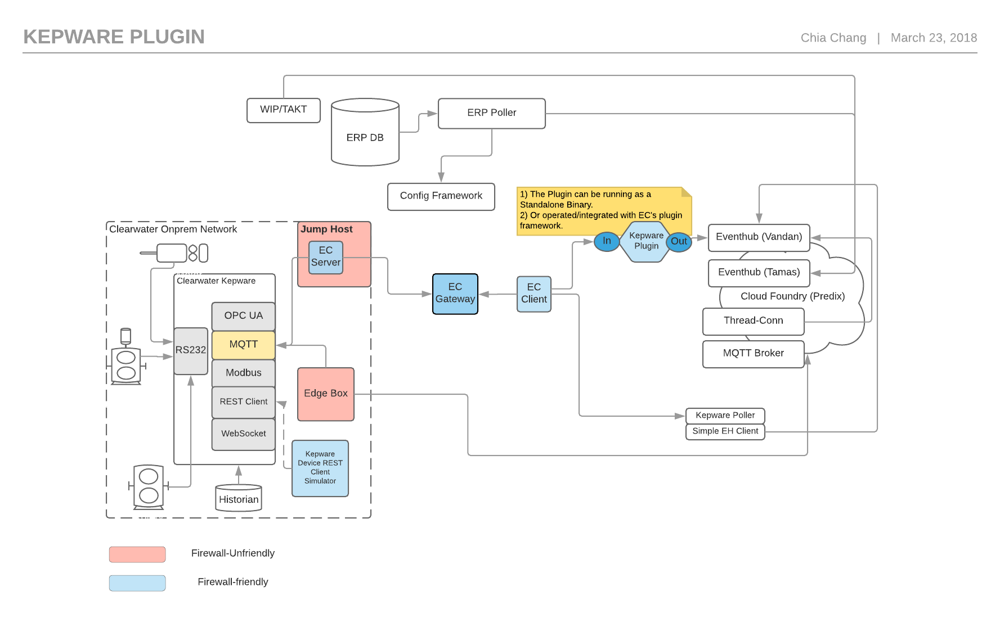

# Kepware Plugin Usage

* [Introduction](#introduction) 
  * [High-Level Network-Comp. Deployment Diagram](#high-level-network-comp-deployment-diagram)
  * [Simplifying Deployment](#simplifying-deployment)
  * [Enhanced Security](#enhanced-security)
* [Usage Manual](#usage-manual)
  * [Requirement](#requirement)
  * [Plugin Compatibility Table](#plugin-compatibility-table)
  * [Step one of tree- Setup the agent for the Ingress traffic](#step-one-of-tree--setup-the-agent-for-the-ingress-traffic)
  * [Step two of three- Configure the plugins.yml](#step-two-of-three--configure-the-pluginsyml)
    * [Ingress](#ingress)
    * [Egress](#egress)
    * [Logging](#logging)
  * [Step three of three - launch the agent and the plugin for the Egress traffic](#step-three-of-three---launch-the-agent-and-the-plugin-for-the-egress-traffic)
* [Live Demo/Data](#live-demodata)
* [Project Contributors/Sponsors List](#project-contributorssponsors-list)

## Introduction
The Kepware plugin is designed to benefit the Predix subscribers who are interested in the Kepware-->PxEventHub data-ingestion initiative. The plugin is capable of performing a realtime protocols-exchange for ingress protocols such as MQTT, WebSocket, HTTP, OPC UA/DA, TCP, and several high-performance egress frameworks, e.g. gRPC, supported by Predix EventHub service.

This usage guide assumes that the reader has the basic knowledge of Enterprise-Connect operation, and is currently a subscriber to a EC service in Predix. If not, please [checkut our usage doc](https://github.com/Enterprise-connect/ec-misc-docs) as for your beginning.

The GE Power Clearwater plant adopted the [Enterprise-Connect Four-way Bi-directional Virtual Connectivity](https://github.com/Enterprise-connect/ec-sdk/wiki/EC-Agent#usage-scenario-one--four-way-bi-directional-virtual-connectivity) topolygy for its Kepware plugin usage. This instruction manual will use the plant as an example to pivot towards the plugin's overall usage and its deployment strategy.

### High-Level Network-Comp. Deployment Diagram
Avaialbe also in [the original format](https://www.lucidchart.com/invitations/accept/38742699-09fe-4f68-ada9-dbb82fa1efd0)


### Simplifying Deployment
The plugin may operate as a standalone app, please reach out to the user group for more details ec-usergroup@ge-developer-cloud.flowdock.com. However, in most industrial use cases, the Enterprise-Connect agent/service is needed to establish a secure tunnel for data-ingestion purposes.

The combination of EC Agent and the plugin is less than 20MB. With the minimum requirement of 128Mb in-memory, you may bridge the data from anywhere in the world into the designated environment.

### Enhanced Security
The plugin performs data-exchange operations via the Enterprise-Connect security network which will maximise the security compatibility and deliver an uncompromised quality in performance results.

## Usage Manual
### Requirement
 - Enterprise-Conn SDK
 - Enterprise-Conn Service w/ Predix
 - Kepware and/or any brokers supporting MQTT protocols.
 - Predix EventHub
 
### Plugin Compatibility Table

--- | Beta | Dist
--- | --- | --- 
Service | v1051+ | TBD
Agent | v1225+ | TBD
Plugin | v1 | TBD

### Step one of tree- Setup the agent for the Ingress traffic
Again assuming that you have the basic knowledge of Enterprise-Connect operation, and is currently a subscriber to the EC service in Predix. If not, please [checkout our usage doc](https://github.com/Enterprise-connect/ec-misc-docs) as your first step.

Please verify your network environment in order to decide whether the ```pxy``` (Proxy) makes sense for your agent deployment.

```bash
c:\> windows_var.exe -mod server \
       -aid <agent Id A> \
       -hst wss://example-gateway.run.ice.predix.io/agent \
       -rht <Kepware MQTT Broker IP> \
       -rpt <Kepware MQTT Broker Port> \
       -cid <client id> \
       -csc <client secret> \
       -oa2 https://<you UAA uri>/oauth/token \
       -dur 300 \
       -dbg \
       -hca 7990 \
       -shc \
       -zon <your service zone id> \
       -sst <EC service uri> \
       -pxy http://PITC-Zscaler-Americas-Cincinnati3PR.proxy.corporate.ge.com:80
```

### Step two of three- Configure the plugins.yml
The following plugins.yml file requires to be presented in the same directory of the agent/plugin by the time of executing the agent/plugin.

```yaml
  kepware:
    status: active
    command: ./main -dbg
    in:
      type: mqtt
      config:
        cid: data-ingestion
        usr: <usr>
        pwd: <pwd>
        hst: localhost
        prt: 7883
        tpc: opcData/vacuum
    out:
      type: proto-px
      config:
        sbj: clearwater
        ptc: grpc
        uri: 'event-hub-aws-usw02.data-services.predix.io:443'
        px-header: 'Predix-Zone-Id'
        px-zone: <zone>
        cid: <cid>
        csc: <csc>
        oauth: 'https://<zone>.predix-uaa.run.aws-usw02-pr.ice.predix.io/oauth/token'
        pxy: 'http://PITC-Zscaler-Americas-Cincinnati3PR.proxy.corporate.ge.com:80'

```

#### Ingress
There are several types of protocols supported by this plugin. Currently it's pre-set to MQTT for the beta testing. Pay more attention on the ```tpc``` (Topic) configuration, this needs to match your topic which setup in the MQTT broker.

#### Egress
Currently we support gRPC and Predix UAA. You may need to set the pxy (proxy) if you're to deploy this plugin in a onprem/vpn network.

#### Logging
It is important to know that the Kepware plugin support the file-level logging. Once your agent successfully launches the plugin as a sub-process, you will be able to see the history of logs produced inside of the sub-process. The log file ```.connectivity.log``` will be saved in the root directory of your agent/plugin. There is a **20Mb** limitation on the log file. Agent will reset all logging history once the 20Mb threshold is met.

You may tail the logs following the simple command below-
```bash
:<agent/plugin directory>$ tail -f .connectivity
```

### Step three of three - launch the agent and the plugin for the Egress traffic
```bash
c:\> windows_var.exe -mod client \
        -aid <agent Id B> \
        -hst wss://example-gateway.run.ice.predix.io/agent \
        -lpt 7883 \
        -tid <agent Id A> \
        -oa2 https://<your UAA>/oauth/token \
        -cid <client_id> \
        -csc <client secret> \
        -shc \
        -dur 300 \
        -dbg \
        -pxy http://PITC-Zscaler-Americas-Cincinnati3PR.proxy.corporate.ge.com:80 \
        -plg
```
The ```-plg``` (Plugin) flag here indicates that you would like the agent to launch the plugin app based on your plugins.yml settings from the previous step.

At this stage you should be seeing your data streaming overwhelmingly by subsuming to your Predix Eventhub instance. If not, you may join our [internal usergroup](https://www.flowdock.com/app/ge-developer-cloud/ec-usergroup) or contact the one of the contributors from the list below for enabling. 

## Live Demo/Data
The GE Power Clearwater Plant team plays the key role to this successful Data-Ingestion initiative. Their contributions ranging from the network architecture, machine-configuration, to my first onsite tour in a GE Power facility one like this in Clearwater, FL.

There are currently two MQTT topics which are running 24/7, dedicated by an onprem Kepware system in the onsite facility. For those of you currently subscribing to the PxEventHub, and are interested in giving the data-streaming a shot, please use the following credential setting in your plugins.yml file.

```yaml
ec-plugin:
  kepware:
    status: active
    command: ./main -dbg
    in:
      type: mqtt 
      config:
        cid: data-ingestion
        usr: wind
        pwd: '!Wind12345'
        hst: localhost
        prt: 7883
        tpc: opcData/vacuum
    out:
      type: proto-px
      config:
        sbj: clearwater
        ptc: grpc
        uri: 'event-hub-aws-usw02.data-services.predix.io:443'
        px-header: 'Predix-Zone-Id'
        px-zone: <zone>
        cid: <cid>
        csc: <csc>
        oauth: 'https://<zone>.predix-uaa.run.aws-usw02-pr.ice.predix.io/oauth/token'
        pxy: 'http://PITC-Zscaler-Americas-Cincinnati3PR.proxy.corporate.ge.com:80'
```

## Machine Data Ingestion Simulator
The simulator helps to randomly mock a series of machine data ingesting via several HTTP Publish endpoints which available from the Kepware channel settings. [The simulator is available in its opensource format](https://github.build.ge.com/212359746/project-kepware-device-simulator) for your further research of Kepware-relate topic.

## Project Contributors/Sponsors List

 - GE Power Clearwater IT team: [*Marek Noha*](mailto:Marek.Noha@ge.com), [*David M. Robinson*](mailto:David.M.Robinson@ge.com), [*Bob Criswell*](mailto:Bob.Criswell@ge.com)
 - Data-Ingestion team: Jack Porco, [*Kenneth Shum*](mailto:Kenneth.Shum@ge.com) (Leader), [*Chris Rutherford*](mailto:Chris.Rutherford@ge.com), [*Glorius Gaduang*](mailto:Glorius.Gaduang@ge.com)
 - Supply-Chain Leader/Sponsor: [*Nate Arnold*](mailto:Nathaniel.Arnold@ge.com)
 - Enterprise-Connect product Leader/Sponsor: [*Prasada Alokam*](mailto:prasada.alokam@ge.com)
 - Thread-Connect PxEventHub team: [*Vandan Juvekar*](mailto:Vandan.Juvekar@ge.com) (Leader), [*Abdullah Munaz*](mailto:abdullah.munaz@ge.com), [*Mahesh Venukadasula*](mailto:mahesh.venukadasula@ge.com)
 - Authour/Developer: [*Chia Chang*](mailto:Chia.Chang@ge.com)
 
 ## Reference
 <sub>
 i. Predix EventHub Service (https://docs.predix.io/en-US/content/service/data_management/event_hub/)<br />
 ii. Google Protobuf (https://github.com/google/protobuf)<br />
 iii. gRPC unified API framework (https://grpc.io/docs/guides/)<br />
 iv. MQTT standard (http://mqtt.org/documentation)<br />
 v. OPC UA/DA standards (https://opcfoundation.org/)<br />
 v1. PTC Kepware software bundle (https://www.kepware.com/en-us/)
</sub>
